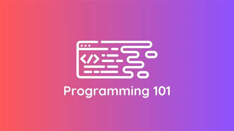

# 🧑‍💻 Programming 101: Bash & Linux Scripting for Beginners



Welcome to **Programming 101** – your open-source gateway to learning Bash scripting, mastering the Linux command line, and understanding how computers interact under the hood.

Whether you're an absolute beginner or just curious about the command line, you're in the right place!

---

## 🚀 What You’ll Learn

- 🐧 Introduction to Linux OS and terminal basics
- 🧭 Navigating the file system with Bash commands
- ✍️ Writing, running, and debugging Bash scripts
- 🔁 Using variables, conditionals, and loops
- 📂 Managing files, directories, and permissions
- ⚙️ Automating tasks with functions and modular scripts
- 🛠️ Script debugging and environment management

---

## 🧭 Course Map (Repository Structure)

```bash
programming-101/
├── README.md               # This file
├── syllabus.md             # Full course outline
├── setup.md                # Setup instructions (Linux, Mac, Windows)
├── lessons/                # Core lessons per module
├── exercises/              # Practice exercises per topic
├── quizzes/                # Review quizzes
├── scripts/                # Setup & helper scripts
├── assets/                 # Images, diagrams, PDFs
├── resources.md            # Recommended readings & links
├── CONTRIBUTING.md         # How to contribute
├── CODE_OF_CONDUCT.md      # Community standards
└── LICENSE                 # License (MIT)
````

🧠 **Everything you need to go from beginner to confident Linux scripter!**

---

## 📝 Getting Started

1. **Clone the repository**

   ```bash
   git clone https://github.com/kc-clintone/programming-101.git
   cd programming-101
   ```

2. **Set up your environment**
   Follow [setup.md](setup.md) to configure your terminal and tools.

3. **Explore the syllabus**
   Open [syllabus.md](syllabus.md) to see the full course outline.

4. **Start learning**
   Begin with the first lesson in [`lessons/01-intro_to_linux/`](docs/lessons/01-intro_to_linux/what_is_linux.md) and follow along with exercises and quizzes.

---

## 💡 Who Is This For?

🎓 **You**, if you’re:

* A complete programming beginner
* Curious about Linux or terminal-based systems
* Looking to learn scripting for automation or DevOps
* Teaching others or coaching a beginner group

🧯 No prior coding experience required!

---

## 🤝 How to Contribute

We 💖 contributions!

* Read [CONTRIBUTING.md](CONTRIBUTING.md) for how to report issues or suggest lessons.
* Follow our [CODE\_OF\_CONDUCT.md](CODE_OF_CONDUCT.md) to keep this space welcoming.

---

## 📚 Additional Resources

* [LinuxCommand.org](https://linuxcommand.org/)
* [Bash Manual (GNU)](https://www.gnu.org/software/bash/manual/)
* [Bash Scripting Tutorial (Ryan’s Tutorials)](https://ryanstutorials.net/bash-scripting-tutorial/)
* [The Art of Command Line](https://github.com/jlevy/the-art-of-command-line)

More links in [resources.md](resources.md) →

---

## 📬 Contact & Feedback

Questions? Suggestions?
Open an [issue](https://github.com/kc-clintone/programming-101/issues) or join the repo’s **Discussions** tab.

📄 [Download the Full Course as PDF](assets/pdf/index.pdf)

---

> *"The best way to learn is by doing."* – Richard Feynman

## Happy hacking! 🧑‍💻💥

